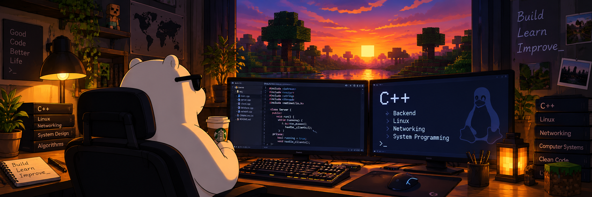

<h1 align="center">Maxim Burmatov</h1>

  <b>C++ • Backend • Linux • Networking</b>

  Computer Engineering student focused on C++ backend development,
  networking and system programming.

---

# 🇬🇧 English

## 👨‍💻 About me

- 🎓 Computer Engineering student at **IRNITU**
- 💻 Main programming language: **C++**
- 🐧 Working and learning in **Linux**
- 🌐 Interested in **backend development, networking and system programming**
- 🧠 Practicing **algorithms and data structures**
- 🚀 Building educational and practical projects

---

## 🛠 Technologies

### Main

  
  
  
  
  
  
  
  
  

### Also familiar with

  
  
  

---

## 📚 Currently learning

  
  
  
  
  

---

## 🎯 Goals

- Develop strong **C++ backend development** skills
- Build practical and educational projects
- Deepen my knowledge of **Linux, networking and system programming**
- Grow as a **C++ developer**

---

# 🇷🇺 Русский

## 👨‍💻 Обо мне

- 🎓 Студент направления **«Информатика и вычислительная техника»** в **ИРНИТУ**
- 💻 Основной язык программирования: **C++**
- 🐧 Работаю и изучаю разработку в **Linux**
- 🌐 Интересуюсь **backend-разработкой, компьютерными сетями и системным программированием**
- 🧠 Практикую **алгоритмы и структуры данных**
- 🚀 Разрабатываю учебные и практические проекты

---

## 🛠 Технологии

### Основные

  
  
  
  
  
  
  
  
  

### Также знаком

  
  
  

---

## 📚 Сейчас изучаю

  
  
  
  
  

---

## 🎯 Цели

- Развивать навыки **backend-разработки на C++**
- Создавать практические и учебные проекты
- Углублять знания **Linux, компьютерных сетей и системного программирования**
- Развиваться как **C++ разработчик**
